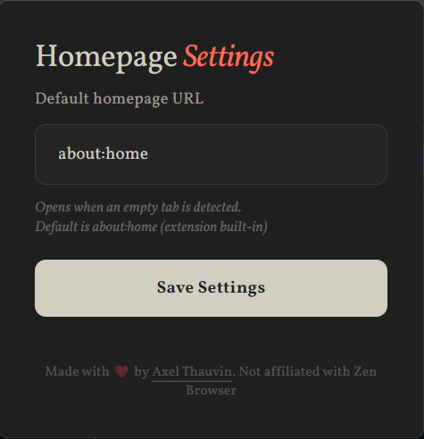

#  Zen - Homepage Fixer

[](https://opensource.org/licenses/MIT)
[](https://zen-browser.app/)
[](https://github.com/Axthauvin/zen-home-page-fix/releases)

A Firefox extension that automatically opens a customizable homepage when the last tab is closed in [Zen browser](https://zen-browser.app/).


## Features

- **Auto-opens homepage** when closing tabs
- **A (kinda) nice custom homepage** with a Zen-inspired design
- **Built-in search** functionality for quick access
- **Customizable shortcuts** to your favorite websites
- **Easy configuration**: set any URL as your default homepage

## What It Does

This extension monitors your browser tabs and automatically opens your chosen homepage whenever you close the last non-pinned tab in a window.


> The actual Zen window when no tabs are opened

## Quick Start

### Installation

Download the latest release from the [Releases page](https://github.com/Axthauvin/zen-home-page-fix/releases) and install it in Zen browser.

### Configuration

Click on the extension icon in your toolbar to open the configuration popup. Here you can:

- **Set any URL as your default homepage**: Enter any website URL (e.g., `google.com`, `github.com`, `reddit.com`)
- The extension will automatically open this URL when you close your last tab
- Leave it empty to use the extension built-in homepage
- Changes are saved automatically




## Contributing

Please contribute! Whether you're fixing bugs, adding features, or improving documentation, your help makes this project better for everyone.
Feel free to [create an issue](https://github.com/Axthauvin/zen-home-page-fix/issues) if you find a bug

### Getting Started

1. **Fork the repository**

   ```bash
   # Visit https://github.com/Axthauvin/zen-home-page-fix and click "Fork"
   ```

2. **Clone your fork**

   ```bash
   git clone https://github.com/YOUR-USERNAME/zen-home-page-fix.git
   cd zen-home-page-fix
   ```

3. **Create a feature branch**
   ```bash
   git checkout -b feature/your-feature-name
   ```

### Development

1. Load the extension in Firefox:

   - Open `about:debugging`
   - Click "Load Temporary Add-on"
   - Select the `manifest.json` file from this repository

2. Make your changes to the source files

3. Test your changes in Zen browser

## Bug Reports & Feature Requests

Found a bug or have a feature idea? Please [open an issue](https://github.com/Axthauvin/zen-home-page-fix/issues) with:

## 📄 License

This project is licensed under the MIT License

---

<div align="center">

Made with ❤️ for Zen Browser users  
[Report Bug](https://github.com/Axthauvin/zen-home-page-fix/issues/new) · [Request Feature](https://github.com/Axthauvin/zen-home-page-fix/issues/new)

</div>
